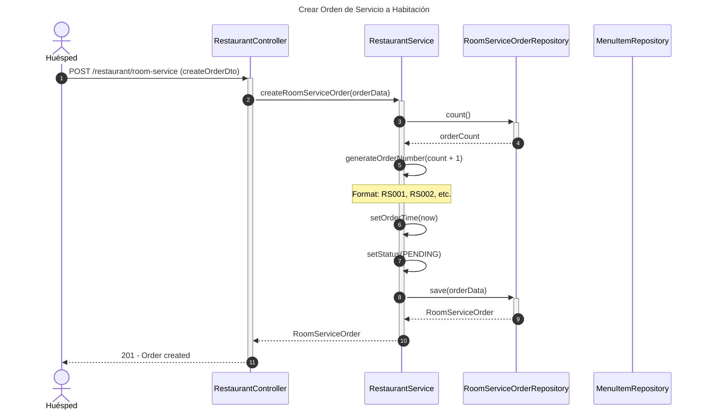
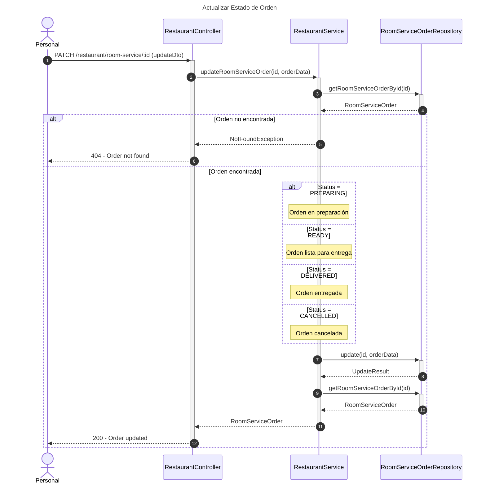
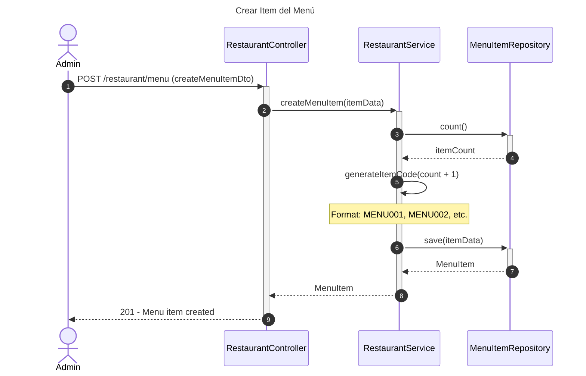
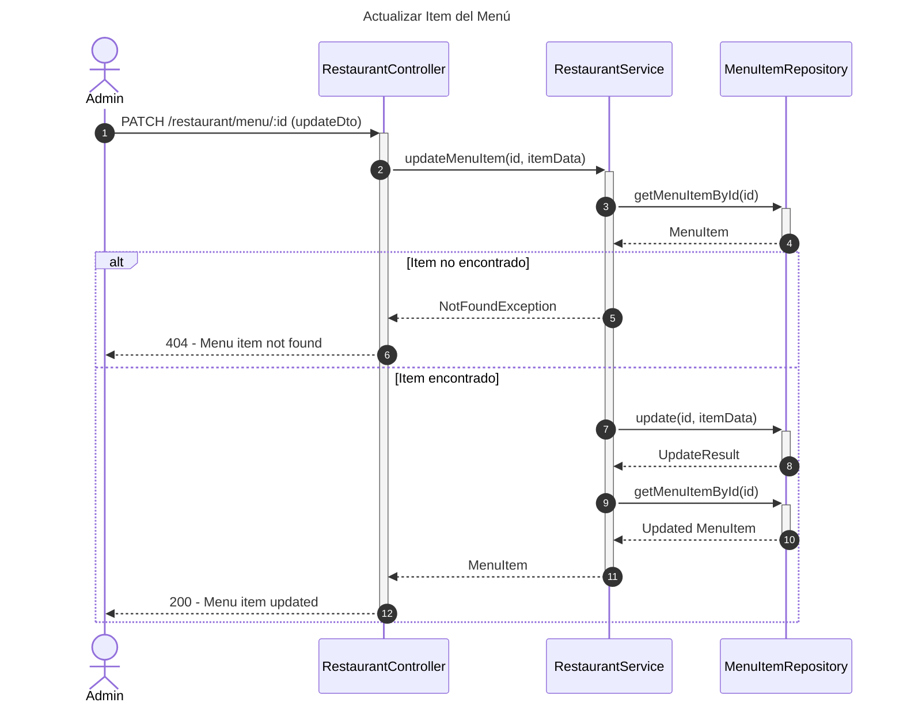
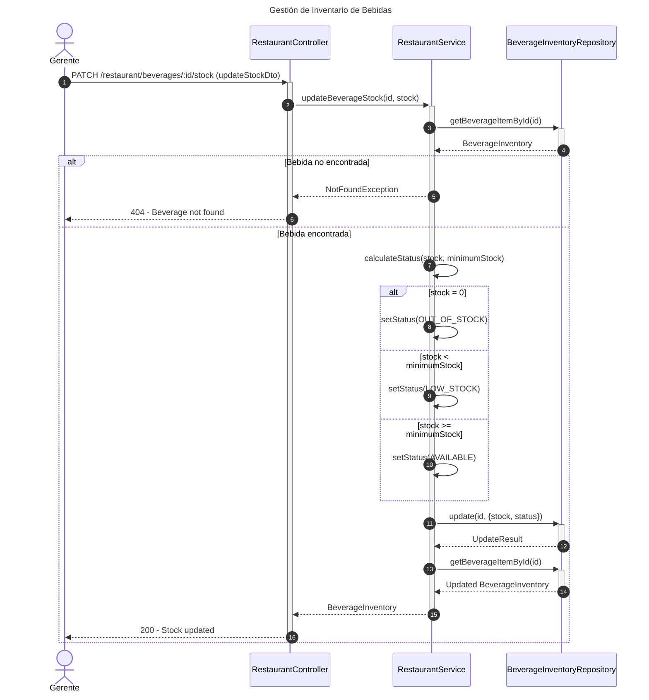
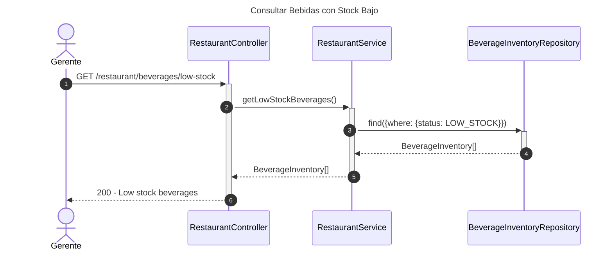
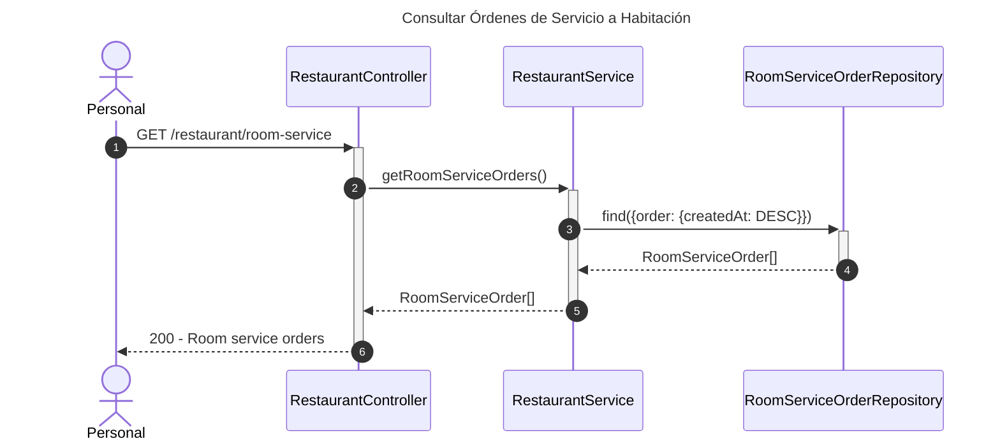

# Diagrama de Secuencia - Módulo de Restaurante

## 1. Crear Orden de Servicio a Habitación

## 2. Actualizar Estado de Orden

## 3. Gestión de Menú - Crear Item

## 4. Actualizar Item del Menú

## 5. Gestión de Inventario de Bebidas

## 6. Consultar Bebidas con Stock Bajo

## 7. Consultar Órdenes de Servicio a Habitación

## Descripción de Flujos

### 1. Crear Orden de Servicio a Habitación

- Huésped solicita servicio a habitación
- Se genera número de orden automáticamente
- Se establece hora de pedido y estado inicial (PENDING)
- Se guarda la orden con items y total

### 2. Actualizar Estado de Orden

- Personal actualiza estado de la orden
- Ciclo: PENDING → PREPARING → READY → DELIVERED
- También permite CANCELLED en cualquier momento
- Tracking del progreso de la orden

### 3. Gestión de Menú - Crear Item

- Administrador agrega nuevo item al menú
- Se genera código único automáticamente
- Se incluyen precio, ingredientes, alérgenos
- Se define disponibilidad y tiempo de preparación

### 4. Actualizar Item del Menú

- Permite modificar cualquier atributo del item
- Útil para cambios de precio, disponibilidad
- Actualización de ingredientes o alérgenos

### 5. Gestión de Inventario de Bebidas

- Actualización de stock de bebidas
- Cálculo automático de estado según stock
- Alertas de stock bajo o agotado

### 6. Consultar Bebidas con Stock Bajo

- Consulta rápida de bebidas que necesitan reabastecimiento
- Filtra por stock menor al mínimo
- Útil para planificación de compras

### 7. Consultar Órdenes de Servicio a Habitación

- Lista todas las órdenes
- Ordenadas por fecha de creación (más recientes primero)
- Permite monitoring de servicio a habitación

## Patrones Implementados

- **State Pattern**: Estados de orden (PENDING, PREPARING, READY, DELIVERED, CANCELLED)
- **Factory Pattern**: Generación automática de códigos y números de orden
- **Repository Pattern**: Acceso a datos a través de repositorios
- **Service Layer**: Lógica de negocio en el servicio
- **Strategy Pattern**: Cálculo de estado de bebidas según stock
