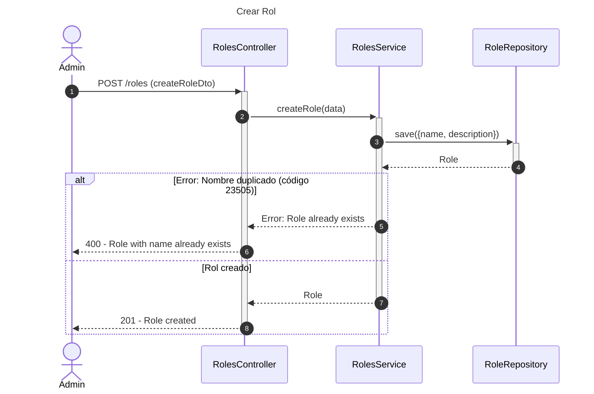
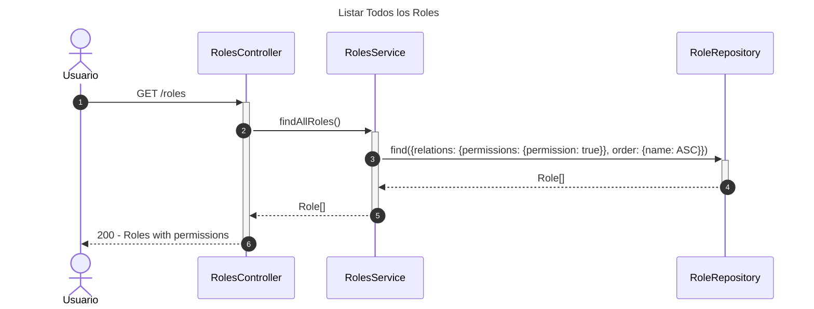
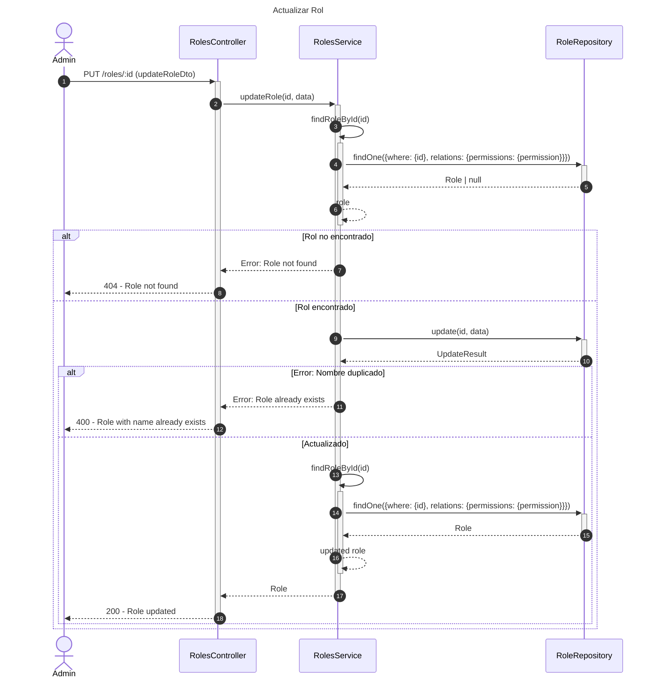
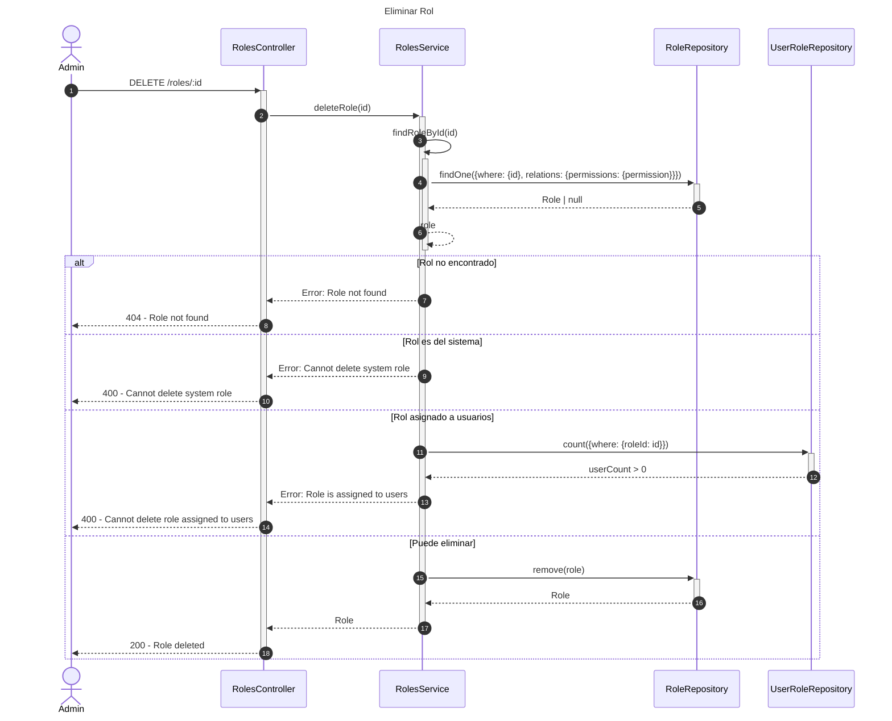
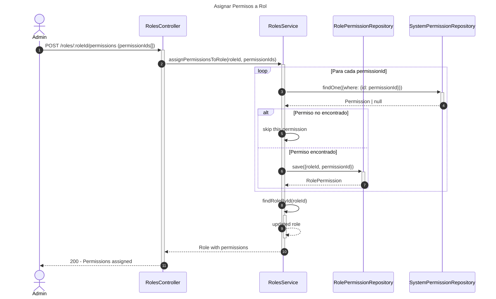
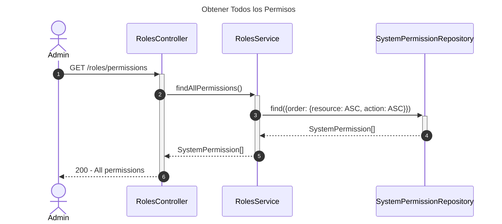

# Diagrama de Secuencia - Módulo de Roles

## 1. Crear Rol

## 2. Listar Todos los Roles

## 3. Actualizar Rol

## 4. Eliminar Rol

## 5. Asignar Permisos a Rol

## 6. Obtener Todos los Permisos

## Descripción de Flujos

### 1. Crear Rol

- Crea nuevo rol con nombre y descripción
- Valida unicidad del nombre
- Maneja constraint violations (código 23505)

### 2. Listar Todos los Roles

- Recupera todos los roles con sus permisos
- Incluye relaciones: permissions.permission
- Ordenado alfabéticamente por nombre

### 3. Actualizar Rol

- Valida existencia del rol
- Actualiza nombre y/o descripción
- Valida unicidad del nuevo nombre
- Retorna rol actualizado con permisos

### 4. Eliminar Rol

- Validaciones múltiples:
  - Rol existe
  - No es rol del sistema (isSystem: false)
  - No está asignado a usuarios
- Elimina rol si pasa validaciones

### 5. Asignar Permisos a Rol

- Asigna múltiples permisos a un rol
- Valida existencia de cada permiso
- Crea relaciones RolePermission
- Retorna rol con permisos actualizados

### 6. Obtener Todos los Permisos

- Lista todos los permisos del sistema
- Ordenados por recurso y acción
- Útil para UI de asignación de permisos

## Patrones Implementados

- **Repository Pattern**: Acceso a datos
- **Validation Pattern**: Múltiples validaciones de negocio
- **Constraint Handling**: Manejo de unique constraints
- **System Protection**: Protección de roles del sistema
- **Many-to-Many Pattern**: Relación roles-permisos
