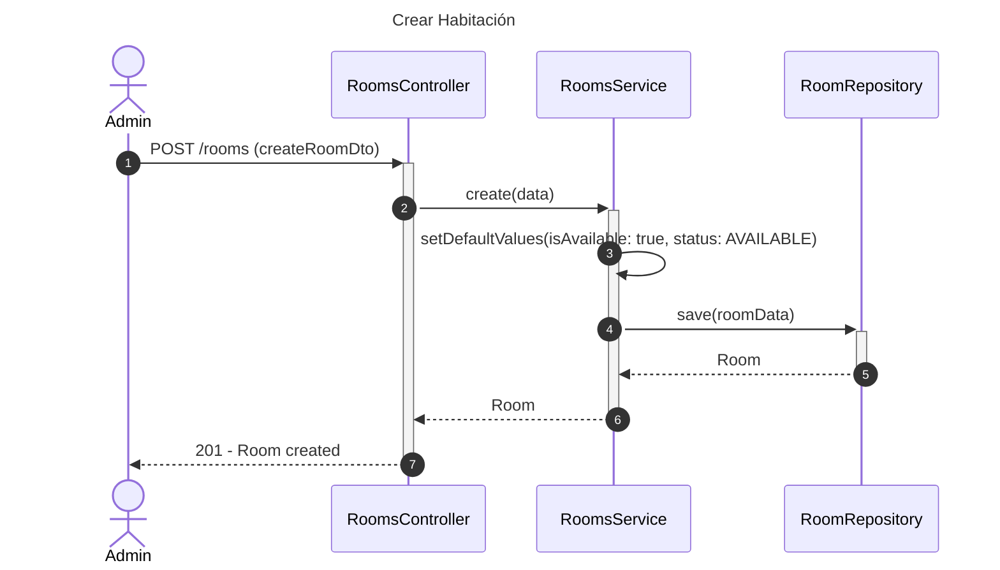
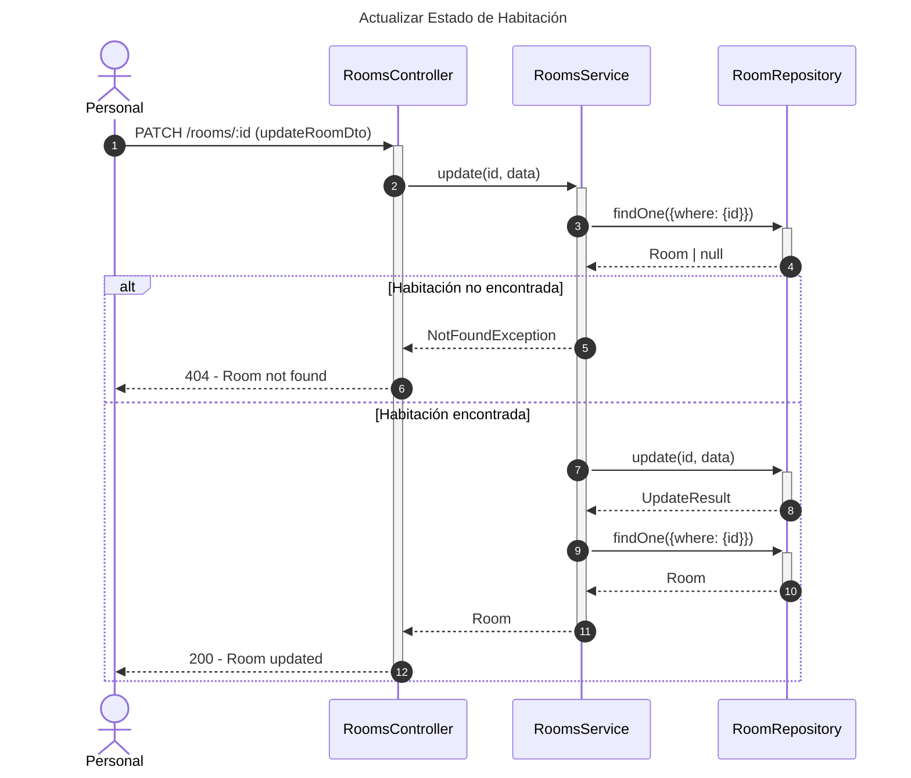
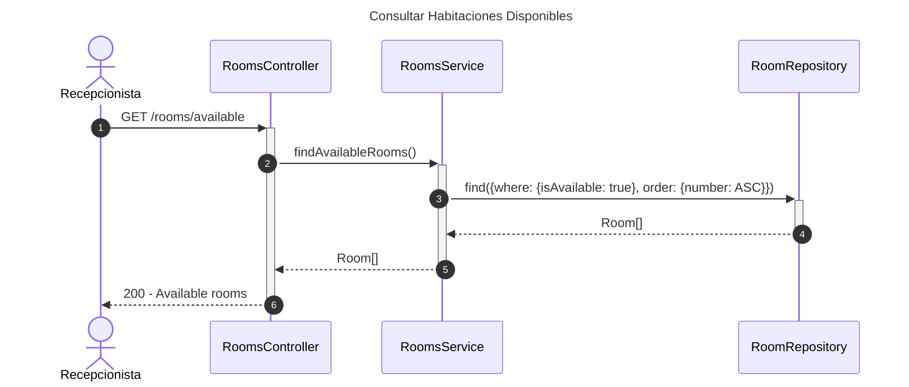

# Diagrama de Secuencia - Módulo de Habitaciones

## 1. Crear Habitación

## 2. Actualizar Estado de Habitación

## 3. Consultar Habitaciones Disponibles

## Patrones Implementados

- **Repository Pattern**: Acceso a datos
- **Service Layer**: Lógica de negocio
- **State Pattern**: Estados de habitación
