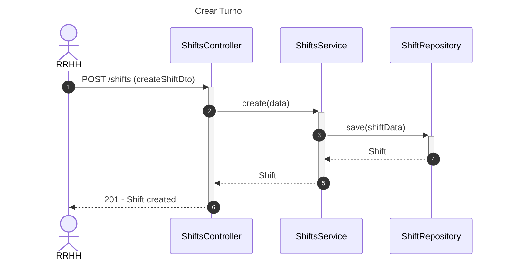
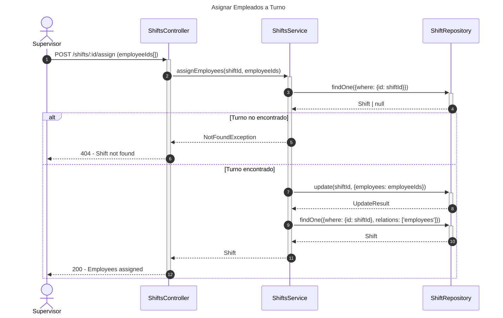
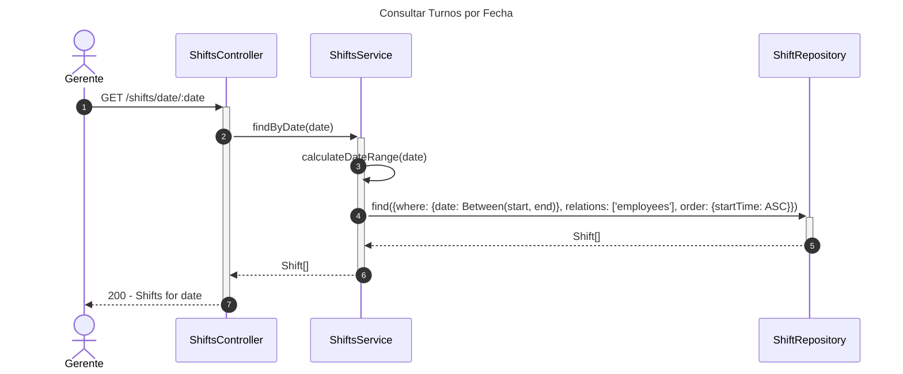

# Diagrama de Secuencia - Módulo de Turnos

## 1. Crear Turno

## 2. Asignar Empleados a Turno

## 3. Consultar Turnos por Fecha

## Patrones Implementados

- **Repository Pattern**: Acceso a datos
- **Many-to-Many Pattern**: Relación shifts-employees
- **Date Range Pattern**: Búsquedas por rango de fechas
