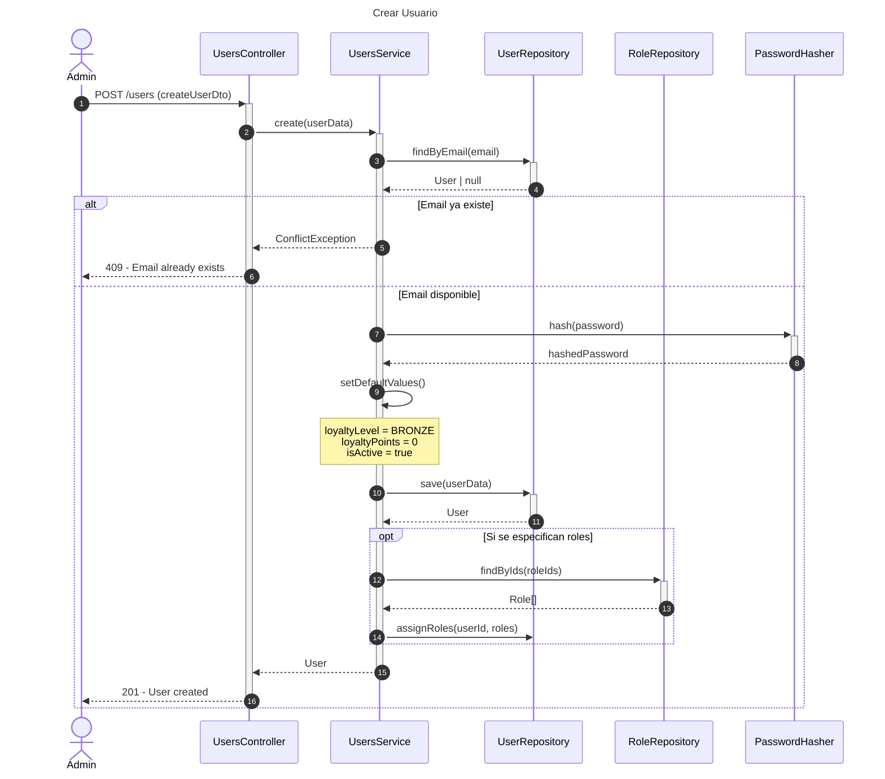
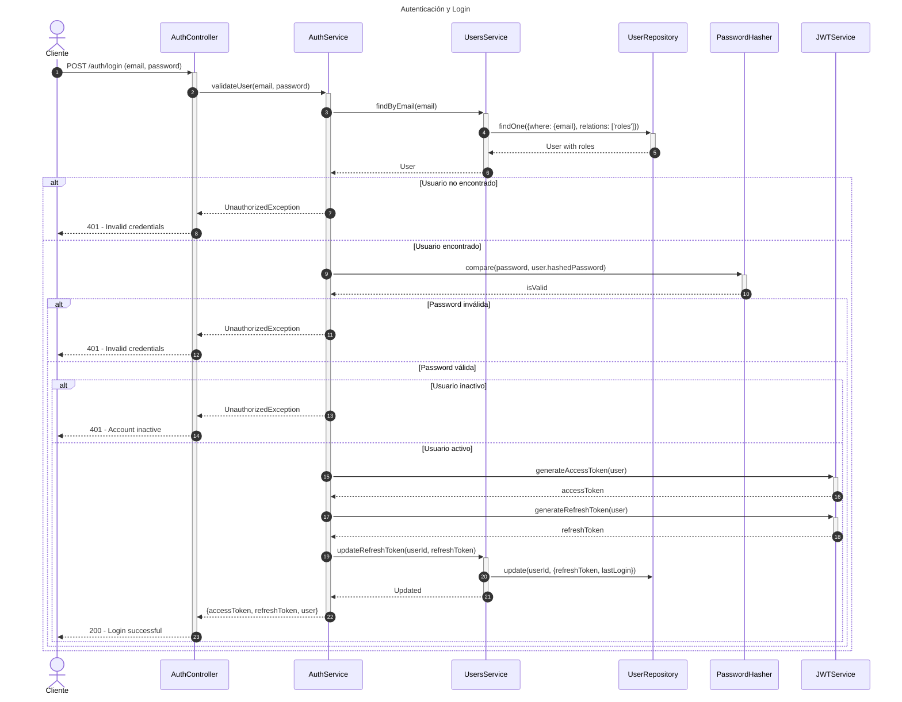
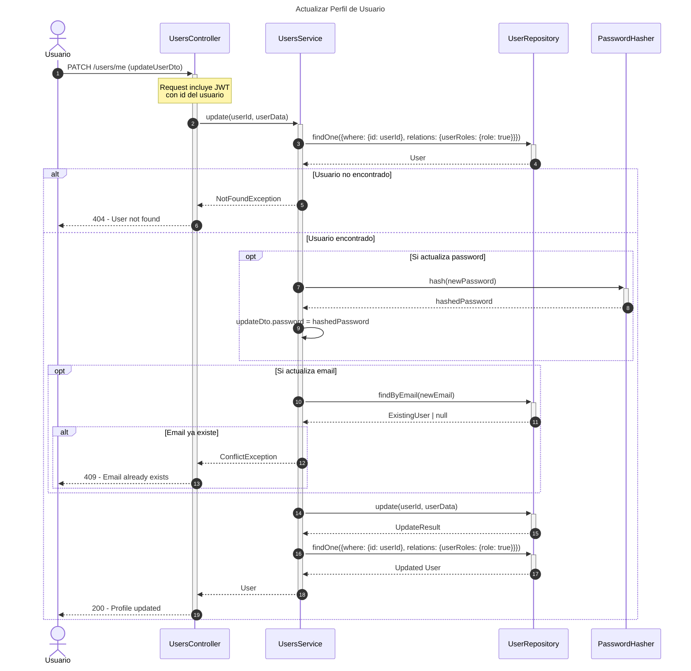
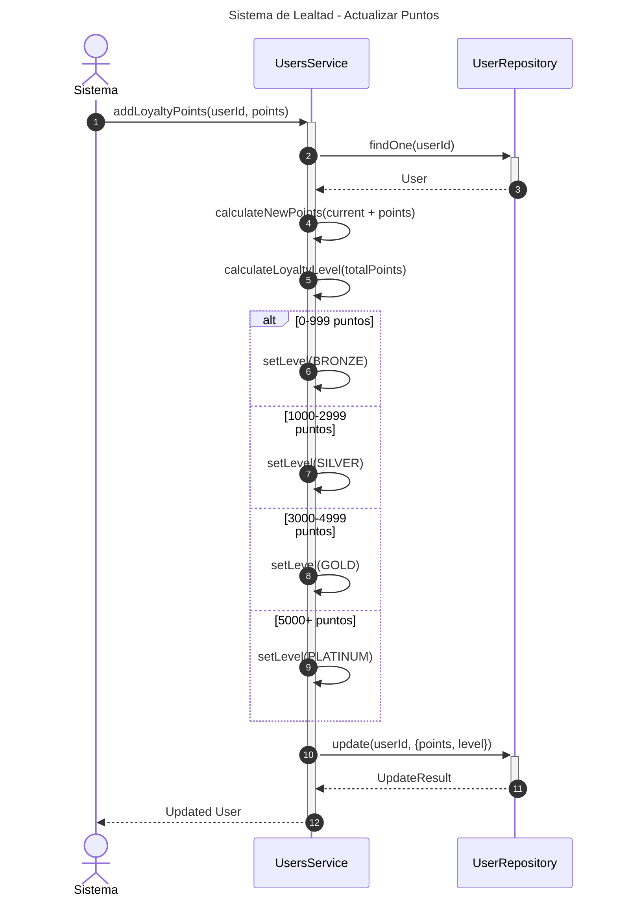
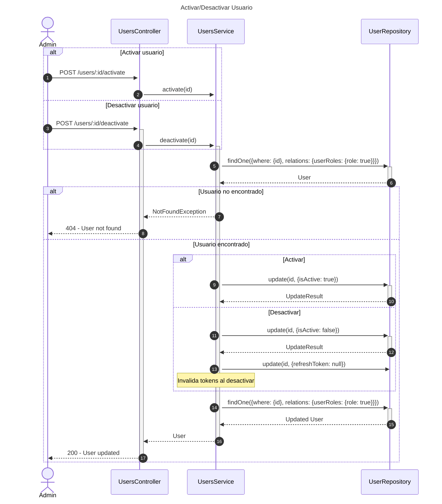
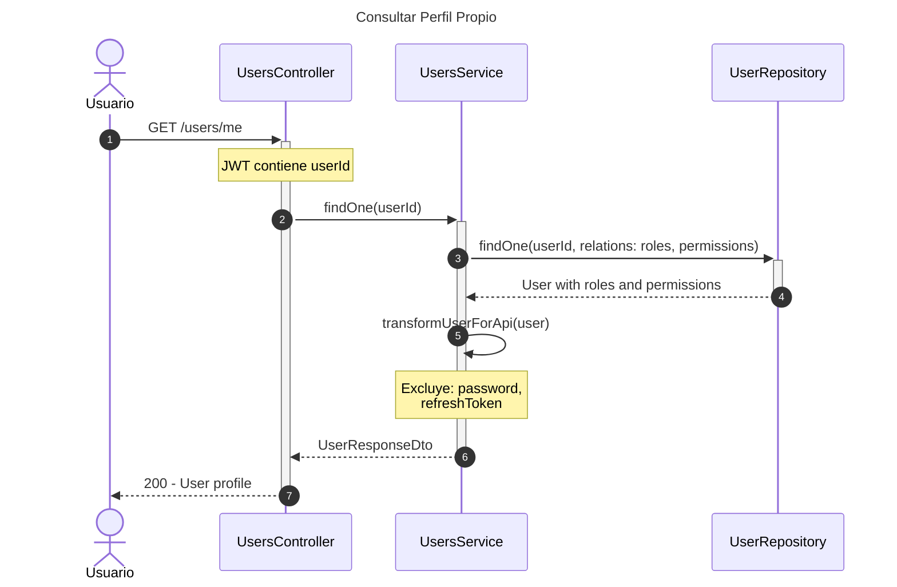
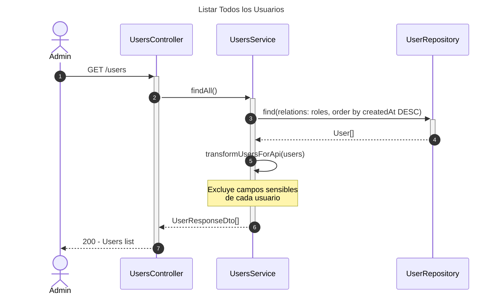

# Diagrama de Secuencia - Módulo de Usuarios

## 1. Crear Usuario

## 2. Autenticación y Login (Integración con Auth)

## 3. Actualizar Perfil de Usuario

## 4. Sistema de Lealtad - Actualizar Puntos

## 5. Activar/Desactivar Usuario

## 6. Consultar Perfil Propio

## 7. Listar Todos los Usuarios (Admin)

## Descripción de Flujos

### 1. Crear Usuario

- Validación de email único
- Hash seguro de contraseña
- Asignación de valores por defecto (BRONZE, 0 puntos)
- Asignación opcional de roles
- Usuario activo por defecto

### 2. Autenticación y Login (Integración con Auth)

- Validación de credenciales
- Verificación de estado activo
- Generación de access y refresh tokens
- Actualización de último login
- Gestión segura de tokens

### 3. Actualizar Perfil de Usuario

- Usuario puede actualizar su propio perfil
- Validación de email único si cambia
- Hash de nueva contraseña si se actualiza
- Protección contra campos sensibles

### 4. Sistema de Lealtad - Actualizar Puntos

- Cálculo automático de nivel según puntos
- Niveles: BRONZE → SILVER → GOLD → PLATINUM
- Actualización atómica de puntos y nivel

### 5. Activar/Desactivar Usuario

- Control administrativo de acceso
- Desactivación invalida tokens
- Activación restaura acceso
- Útil para suspensiones temporales

### 6. Consultar Perfil Propio

- Usuario consulta su propia información
- Incluye roles y permisos
- Excluye datos sensibles
- Basado en JWT del usuario autenticado

### 7. Listar Todos los Usuarios (Admin)

- Solo para administradores
- Lista completa con roles
- Ordenada por fecha de creación
- Datos transformados (sin información sensible)

## Patrones Implementados

- **Repository Pattern**: Acceso a datos a través de repositorios
- **DTO Pattern**: Transformación de datos para API (UserResponseDto)
- **Strategy Pattern**: Niveles de lealtad con diferentes beneficios
- **Observer Pattern**: Sistema de notificaciones en cambios importantes
- **Security Pattern**: Hash de contraseñas, validación de tokens
- **Soft Delete Pattern**: Desactivación en lugar de eliminación
