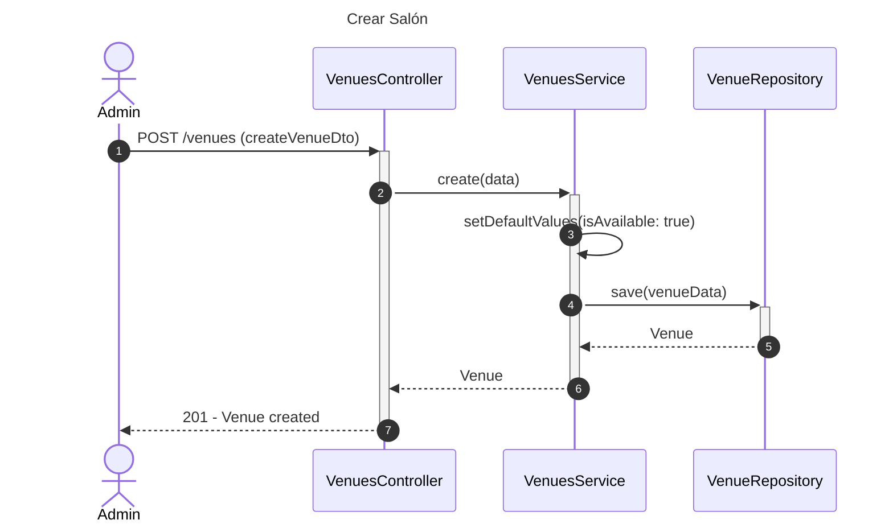
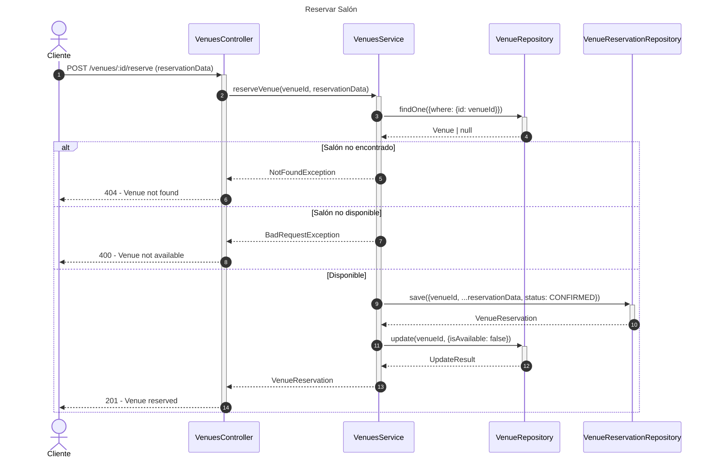
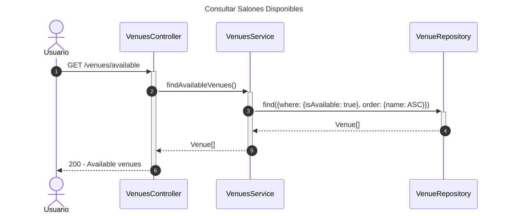

# Diagrama de Secuencia - Módulo de Venues (Salones)

## 1. Crear Salón

## 2. Reservar Salón

## 3. Consultar Salones Disponibles

## Patrones Implementados

- **Repository Pattern**: Acceso a datos
- **Reservation Pattern**: Sistema de reservas
- **State Pattern**: Estados de disponibilidad
